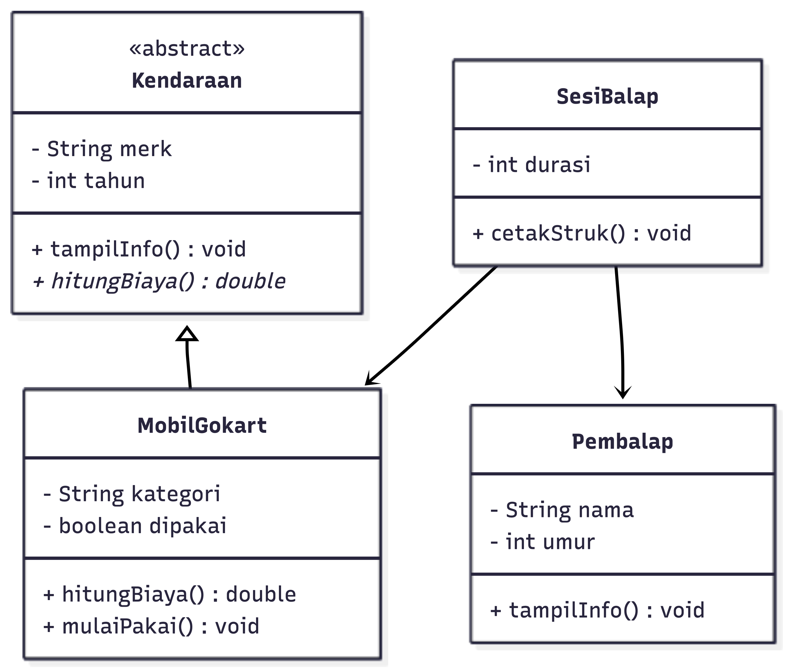
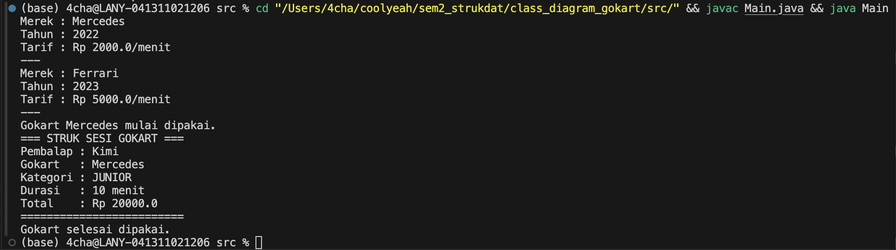

# 🏎️ Sistem Gokart — OOP Java

## 1. Deskripsi Kasus

Arena gokart merupakan salah satu tempat hiburan yang memfasilitasi pemainnya dengan mobil-mobil balap dan sirkuit yang dirancang khusus untuk balapan antar para pemain/pembalap. Mobil tersedia dengan beberapa macam kategori (Junior dan Pro) yang bisa disewa oleh pembalap sesuai umurnya. Adapun untuk mengatur alur permainan ini, diperlukan sistem untuk mengelola informasi gokart, data pembalap, dan sesi pemakaian termasuk  perhitungan biaya otomatis berdasarkan kategori dan durasi.

## 2. Class Diagram

Class diagram ini dibuat dengan menggunakan mermaid.ai, dengan hasil sebagai berikut:

## 3. Kode Program Java

Adapun untuk kode program java, disini saya membuat 4 file java yang mencakup sebagai berikut:

- [Kendaraan.java](src/gokart/Kendaraan.java)
- [MobilGokart.java](src/gokart/MobilGokart.java)
- [Pembalap.java](src/gokart/Pembalap.java)
- [SesiBalap.java](src/gokart/SesiBalap.java)
- [Main.java](src/gokart/Main.java)

## 4. Screenshot Output

Output yang dihasilkan dari Sistem Gokart ini adalah sebagai berikut:

## 5. Prinsip OOP yang Diterapkan

- Encapsulation
Semua atribut di setiap class dideklarasikan private sehingga tidak bisa diakses langsung dari luar class. Akses hanya bisa dilakukan melalui method getter seperti 'getMerek()' dan 'getNama()'.

- Abstraction
'Kendaraan' dibuat sebagai abstract class yang tidak bisa dibuat objeknya secara langsung. Metode 'hitungBiaya()' dideklarasikan abstract tanpa isi, sehingga setiap child class wajib mengisi implementasinya sendiri sesuai jenisnya.

- Inheritance
'MobilGokart extends Kendaraan' — class MobilGokart mewarisi semua atribut dan method dari Kendaraan seperti 'merek', 'tahun', dan 'tampilInfo()' tanpa perlu menulis ulang.

- Polymorphism
Objek 'MobilGokart' disimpan ke dalam array bertipe 'Kendaraan[]', sehingga ketika 'tampilInfo()' dan 'hitungBiaya()' dipanggil lewat loop, Java secara otomatis menjalankan versi method milik 'MobilGokart'.

## 6. Keunikan

Keunikan yang digunakan dalam sistem ini mencakup:

- Tarif Otomatis: Biaya dihitung otomatis berdasarkan kategori (Junior Rp2.000/menit, Pro Rp5.000/menit)
- Status Real-time: Boolean 'dipakai' mencegah satu gokart dipakai dua orang sekaligus
